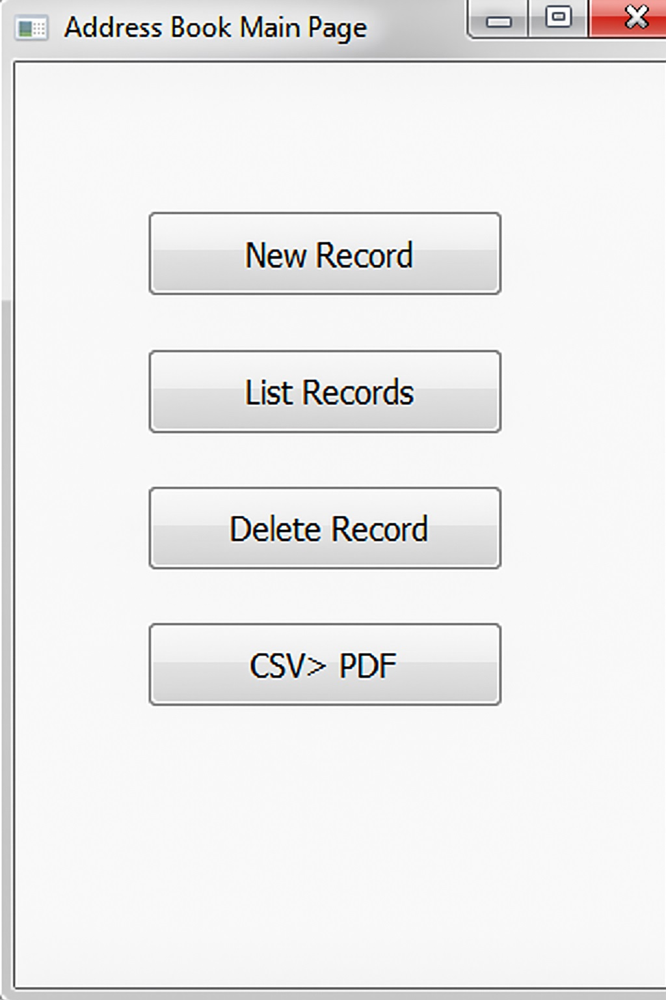
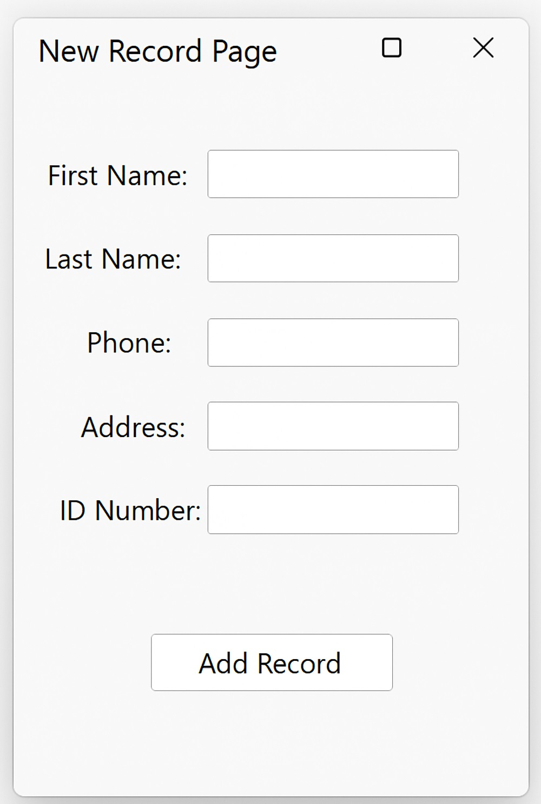
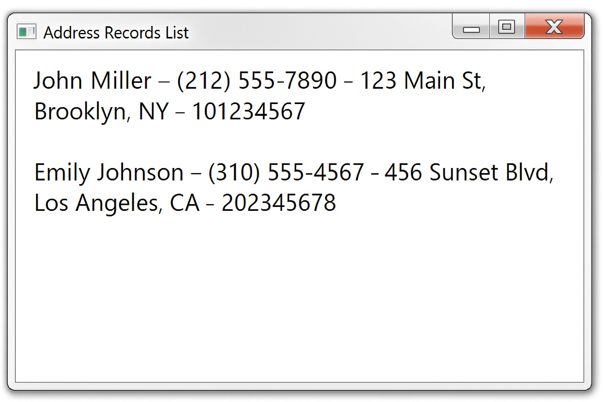
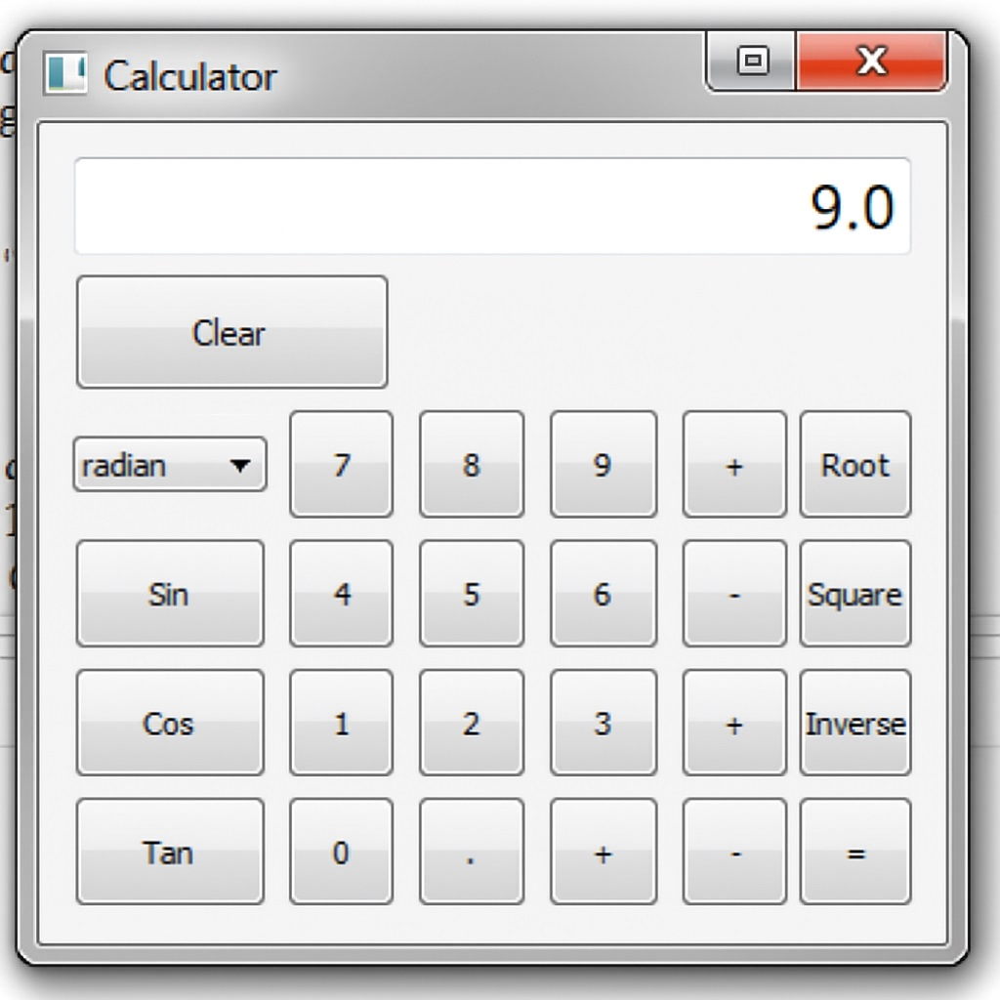

# Python PyQt Mini Projects

A collection of 3 mini PyQt window applications developed as Python course assignments, demonstrating various GUI programming concepts and database integration.

## 📋 About The Project

This repository contains educational mini projects developed using Python programming language and PyQt4 library. Each project demonstrates different GUI (Graphical User Interface) concepts, mathematical algorithms, and database operations.

## 🎯 Projects

### 1. **Compound Interest Calculator** (`compound_interest.py`)
A console-based financial calculator using the bisection method algorithm to determine monthly payment plans.

**Features:**
- Principal amount input
- Monthly interest rate calculation
- 12-month maturity period
- Compound interest computation
- Bisection method for payment optimization
- Automatic rounding to nearest 0.01 currency unit
- Error tolerance configuration (default: 0.01)

**Mathematical Approach:**
- Iterative compound interest application
- Monthly installment distribution
- Payment plan optimization using numerical methods

### 2. **Scientific Calculator** (`calculator.py`)
A feature-rich scientific calculator with trigonometric functions and angle unit conversions.

**Features:**
- Basic arithmetic operations (+, -, ×, ÷)
- Scientific functions (Sin, Cos, Tan)
- Advanced operations (Square root, Square, Reciprocal)
- Angle unit selector (Radian, Degree, Grad)
- Decimal point support
- Sign change functionality
- Clear/backspace operations
- Error handling for invalid operations

**Special Capabilities:**
- Real-time angle unit conversion for trigonometric calculations
- 15-character display limit for precision
- Fixed-size window with organized grid layout

### 3. **Address Book with Database Manager** (`access_db.py`)
A database management application with Microsoft Access integration and contact record display.

**Features:**
- Microsoft Access database (.mdb, .accdb) connectivity
- Browse and select database files
- Configurable database directory path
- TableView display for records
- SQL query execution (displays top 10 records)
- Contact fields: Name, Surname, Phone, Home address
- ODBC driver integration
- Read-only table view interface

**Database Structure:**
- Uses `address` table
- Fields: name, surname, phone, home
- Default path: `C:\Users\Administrator\Desktop\db.accdb`

**Interface Components:**
- Database directory input field
- File browser button
- Data table viewer (1200x600 window)
- Close button

## 🚀 Key Features

- **PyQt4-based** modern GUI applications
- **Database connectivity** with Microsoft Access
- **Scientific computing** capabilities
- **Numerical methods** implementation (Bisection method)
- **Modular code structure** for easy understanding
- **Educational comments** for learning purposes
- **Multiple UI patterns** (Dialog-based, Widget-based)

## 🛠️ Technologies

- **Python** 2.7+ or 3.x
- **PyQt4** - GUI development framework
- **PyQt4.QtSql** - SQL database module
- **Microsoft Access Driver** (ODBC) - For address book
- **Python Math Library** - For scientific calculations

## 📦 Installation

### Prerequisites

```bash
python --version  # Python 2.7+ or 3.x required
```

### Installing Dependencies

**For Windows:**

```bash
# Install PyQt4
pip install PyQt4

# Install ODBC driver for Microsoft Access
# Download and install Microsoft Access Database Engine
# https://www.microsoft.com/en-us/download/details.aspx?id=54920
```

**Note:** PyQt4 is older and may require Python 2.7. For modern systems, consider migrating to PyQt5 or PyQt6.

### Database Setup (For Address Book)

1. Create a Microsoft Access database file named `db.accdb`
2. Create a table named `address` with the following structure:
   - `name` (Text)
   - `surname` (Text)
   - `phone` (Text)
   - `home` (Text)
3. Place the database file in: `C:\Users\Administrator\Desktop\`
   - Or modify the default path in the application

## 💻 Usage

### Running the Scientific Calculator

```bash
python calculator.py
```

**Operations:**
- Click number buttons to enter values
- Select angle unit from dropdown (radyan/derece/grad)
- Use operation buttons for calculations
- Click "Temizle" to clear display
- Click "=" to get results

### Running the Compound Interest Calculator

```bash
python compound_interest.py
```

**Input Required:**
1. Enter principal amount (debt amount)
2. Enter monthly interest rate as percentage (e.g., 5.5 for 5.5%)
3. Program calculates optimal monthly payment plan

**Example:**
```
Enter Principal Amount: 10000
Enter Monthly Interest Rate: 2.5
Output: Payment Plan: 876.23 USD x 12 MONTH
```

### Running the Address Book

```bash
python access_db.py
```

**Steps:**
1. Verify database path in the text field
2. Click "Browse File" to select database (if needed)
3. Application displays top 10 records from address table
4. Records show in table format with all fields

**Important:** Ensure the Access database file exists at the specified path before running.

## 📁 Project Structure

```
python/
│
├── calculator.py              # Scientific calculator application
├── compound_interest.py       # Compound interest calculator (console)
├── access_db.py              # Address book with database
├── pyqt_test.py              # Simple PyQt test/template
│
└── README.md                 # This file
```

## 🎓 Learning Objectives

These projects demonstrate:

- **PyQt4 GUI Development**
  - Widget creation and management
  - Layout systems (QGridLayout, QHBoxLayout)
  - Signal and slot mechanism
  - Dialog and Window classes

- **Database Integration**
  - SQL database connectivity (ODBC)
  - QSqlTableModel and QSqlQuery usage
  - Microsoft Access integration
  - Data display in table views

- **Mathematical Algorithms**
  - Bisection method implementation
  - Compound interest calculations
  - Numerical optimization
  - Error tolerance handling

- **Event Handling**
  - Button click events
  - Input validation
  - Error handling and display
  - User interaction patterns

## 📸 Screenshots

### Address Book - Main Menu

*Main interface with New Record, List Records, Delete Record, and CSV to PDF options*

### Address Book - New Record Form

*Form for adding new contacts with fields: First Name, Last Name, Phone, Address, ID Number*

### Address Book - Records List

*Display of saved contact records with all information*

### Calculator - Main Screen



## 🔧 Technical Details

### Calculator Implementation
- Uses Qt's QToolButton for responsive button design
- Custom Button class with size hints for uniform appearance
- State management for pending operations
- Operator precedence handling (multiplicative before additive)

### Compound Interest Algorithm
- Implements bisection method for root finding
- Iterative compound interest application
- Automatic monthly payment optimization
- Rounds to nearest currency unit (0.01)

### Database Manager
- QODBC driver for Access connectivity
- QSqlTableModel for data representation
- TOP 10 SQL query for performance
- Configurable database path

## ⚠️ Important Notes

### Database Path Configuration
The address book application expects the database at:
```
C:\Users\Administrator\Desktop\db.accdb
```

**To change the default path:**
1. Modify the path in the text field before browsing
2. Or edit line 17 in `access_db.py`:
```python
directory.setText(r"YOUR\CUSTOM\PATH\db.accdb")
```

### PyQt4 Compatibility
- These projects use **PyQt4**, which is older and not actively maintained
- PyQt4 is compatible with Python 2.7
- For Python 3.x compatibility, minor modifications may be needed
- Consider upgrading to PyQt5 or PyQt6 for production use

### Calculator Language
- Button labels: "Temizle" (Clear), "Kok" (Root), "Karesi" (Square), "Tersi" (Reciprocal)

## 🤝 Contributing

This is an educational project developed as course assignments. Contributions, suggestions, and improvements are welcome!

1. Fork the project
2. Create your feature branch (`git checkout -b feature/AmazingFeature`)
3. Commit your changes (`git commit -m 'Add some AmazingFeature'`)
4. Push to the branch (`git push origin feature/AmazingFeature`)
5. Open a Pull Request

## 🐛 Known Issues

1. **PyQt4 Deprecation**: PyQt4 is outdated; migration to PyQt5/PyQt6 recommended
2. **Database Path**: Hard-coded default path may need modification for different systems
3. **ODBC Driver**: Requires Microsoft Access Database Engine installation on Windows
4. **Python 2.7**: Some code may need updates for full Python 3 compatibility

## 🔮 Potential Enhancements

- [ ] Migrate from PyQt4 to PyQt5/PyQt6
- [ ] Add database file picker dialog for address book
- [ ] Implement edit and delete functionality for address records
- [ ] Add search/filter feature for contacts
- [ ] Create GUI for compound interest calculator
- [ ] Add payment schedule visualization (charts/graphs)
- [ ] Implement data export (CSV, PDF, Excel)
- [ ] Add internationalization support
- [ ] Create unit tests
- [ ] Add input validation and error messages
- [ ] Implement dark mode theme


## 📄 License

This project is licensed under the MIT License - see the [LICENSE](LICENSE) file for details.

## 👤 Author

**s-cansin**

- GitHub: [@s-cansin](https://github.com/s-cansin)

## 🙏 Acknowledgments

- Python community for excellent documentation
- PyQt4/Qt framework developers
- Course instructors for project guidance
- Microsoft Access ODBC driver documentation

## 📚 Additional Resources

- [Bisection Method Explanation](https://en.wikipedia.org/wiki/Bisection_method)
- [Least Squares Method Explanation](https://en.wikipedia.org/wiki/Least_squares)

- [PyQt4 Documentation](https://www.riverbankcomputing.com/static/Docs/PyQt4/)
- [Python Official Documentation](https://docs.python.org/)
- [Microsoft Access ODBC Driver](https://www.microsoft.com/en-us/download/details.aspx?id=54920)
- [Qt Designer Tutorial](https://doc.qt.io/qt-5/qtdesigner-manual.html)
- [Events and Signals in PyQt4](https://zetcode.com/gui/pyqt4/eventsandsignals/)

## 💬 Support

For questions, issues, or suggestions:
- Open an issue in this repository
- Review existing issues for common problems
- Check documentation for setup instructions

---

⭐ If you found this project helpful for learning PyQt or GUI programming, please consider giving it a star!

**Note**: These are educational projects developed for learning purposes. The code demonstrates fundamental concepts and may not follow all production-level best practices.